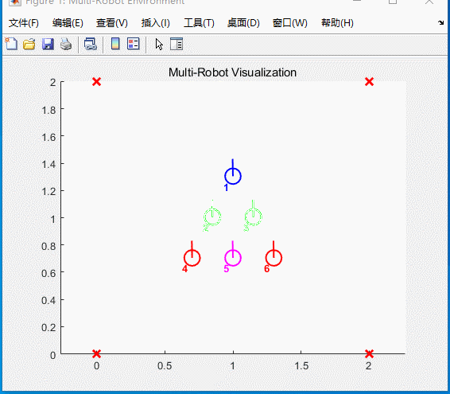
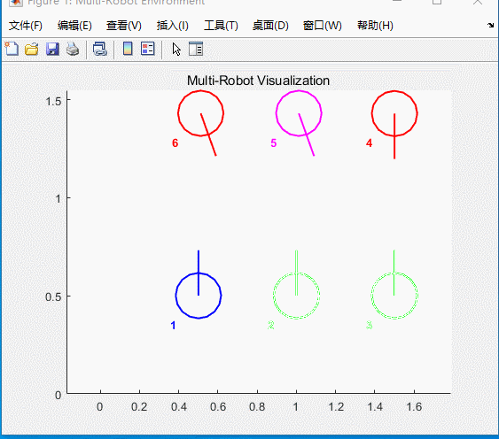

# kk-robot-swarm
<span style="display: flex; flex-direction: column;">
    
 <p style="text-align: center">
    KKswarm
 </p>
</span>

## 简介

### KK目标

开源机器人集群项目`KKSwarm`,由[易科机器人实验室](http://www.exbot.net/)和[阿木实验室](https://www.amovlab.com/)联合匠心打造。

KKSwarm项目旨在为研究人员搭建一个高效、易用的集群研究平台。结合[ROS](https://www.ros.org/)强大的开源生态，让研究人员或者工程师能够快速上手开发。同时也兼顾到理论研究和工程落地之间的跨度，`KKSwarm`项目通过搭建轻量级的仿真环境，再通过参数拟合让仿真和真实环境一致，让仿真环境和真实环境高度匹配，可以实现多智能体等算法的直接过渡，配合上低成本的机器人集群，可以快速在物理环境中验证算法，以达到工程落地的目的。

`KKSwarm`项目通过视觉定位，获取当前机器人的位置和方向。然后根据当前位置和方向，通过算法来控制其下一步的行为。目前`KKSwarm`项目拥有的功能有：

### KK由来
KK（Kilo Ken）Swarm，致敬Kevin Kelly机器社会进化论，一个奉行极简主义的自组织机器人集群，具有丰富的机器人功能，如视觉、控制、学习、协同。同时追求超低成本、超大规模，致力于使群 体智慧走进物理世界。众多低成本机器人互相连接，进而产生他们的信息交流和反馈，相互学习，产生 秩序，以达到集体目标，Kevin Kelly将其称为“群智涌现”。

### 项目功能
`KKSwarm`项目正在成长之中，目前已正式推出的功能有：

1. 独创的全局视觉定位系统，为大规模机器人集群提供低成本、高精度定位服务
2. 提供基于`MATLAB/simulink`仿真与算法开发环境，可一键生成ROS代码并部署至`KKSwarm`机器人系统
3. 提供KKSwarm集群协同simulink模板，可快速上手集群功能
4. 提供KKDeep深度强化学习Simulink模板，免去繁琐的环境配置，训练后控制器可一键生成代码部署至机器人集群
5. 提供ROS rviz在线可视化功能，直观展示集群运行情况
6. 提供Matlab ROS 日志分析功能，方便采集数据进行分析，提升研发效率
7. 支持虚拟雷达，低成本实现复杂分布式算法测试


## 系统说明
<span style="display: flex; flex-direction: column;">
    
 <p style="text-align: center">
    系统数据流向图
 </p>
</span>

`kkswarm`项目通过路由器搭建局域网，集群小车为客户端。所有的算法和定位系统均在服务器主机上进行计算。然后通过TCP/IP协议，将控制指令发送给集群小车，从而控制小车的运动。同时主机服务器通过摄像机实时获取集群小车的位置和方向。

## 软件安装

### 系统要求
   openEuler 以及 ROS Humble

### KKswarm项目安装
```bash
git clone https://gitee.com/amovlab/kk-robot-swarm
```

#### 海康威视相机Linux SDK
1. 进入[海康威视官网](https://www.hikrobotics.com/cn/machinevision/service/download?module=0)，选择`机器视觉工业相机客户端MVS V2.1.0（Linux）` 进行下载

<blockquote style="background-color:#fff7d0;border-left:.5rem solid #e7c000;color: #4e5969;padding-bottom: 15px;">
<p style="font-weight: 600;color:#b29400">注意</p>

根据实际情况，版本可能有小更新。选择 `机器视觉工业相机客户端MVS V2.1.x (Linux)`。本项目使用的是 2.1.2版本
</blockquote>
 
2. 下载完成以后，解压。解压后将会显示适应各种架构的计算机的压缩包。这里选择 `MVS-2.1.2_x86_64_20221208.tar.gz` 这个压缩包进行安装。

3. 解压第2步选择的压缩包
   ```bash
   tar -xvzf MVS-2.1.2_x86_64_20221208.tar.gz
   cd MVS-2.1.2_x86_64_20221208
   sudo bash setup.sh
   ```
    相机驱动将会安装在 `/opt/MVS` 中
   
    启动相机界面的命令为 
   
    ```bash
    cd /opt/MVS/bin
    ./MVS.sh
    ```
    相机驱动的动态链接库路径为 `/opt/MVS/lib/64`

    相机驱动头文件路径为 `/opt/MVS/include/`

4. 安装完毕后，将海康威视的动态库加入到系统动态库中。否则程序将无法运行。
   ```bash
   cd /etc/ld.so.conf.d
   sudo vim hik.conf ## 如果不会vim,则输入 sudo gedit hik.conf
   #在第一行加入相机驱动的动态链接库路径
   /opt/MVS/lib/64
   sudo ldconfig # 刷新配置
   ```
#### Apritag以及Apritag_ros

[apriltag官方简介](https://april.eecs.umich.edu/software/apriltag.html)

[apriltao_ros官方简介](http://wiki.ros.org/apriltag_ros)
`apriltao_ros`只是面向ros1，针对ros2的适配采用的是第三方开源项目[apriltag_ros](https://github.com/wep21/apriltag_ros)，已默认在`KKSWARM`项目的目录当中，并进行了一定的修改。

`KKSWARM` 项目采用的标签家族是 `Tag36h11`，尺寸是`7cm`。 详情见 `doc/apritags1-50.pdf`。您也可以通过软件自动生成该家族标签。详情点击[通过openmv生成apriltag标签](https://blog.csdn.net/wangmj_hdu/article/details/112933915)

##### apritag安装
```bash
cd ~/kk-robot-swarm/
git clone https://github.com/AprilRobotics/apriltag.git
cd apriltag
mkdir build
cd build
cmake ..
make -j4
sudo make install
```
1. Apriltag相关头文件将会被安装在 `/usr/local/include/apriltag`
2. Apriltag相关的库将会被安装在 `/usr/local/lib64/`
3. 安装完毕后，同海康威视的动态库一样，将apriltag的动态库加入到系统动态库中。
   ```bash
   cd /etc/ld.so.conf.d
   sudo vim hik.conf ## 如果不会vim,则输入 sudo gedit hik.conf
   #在第一行加入apriltag的动态链接库路径
   /usr/local/lib64
   sudo ldconfig # 刷新配置
   ```

#### openEuler使用ros
```bash
yum install openeuler-ros
yum install ros-humble-ros-base ros-humble-xxx 例如安装小乌龟ros-humble-turtlesim

#安装colcon等依赖
pip install colcon-common-extensions
pip install matplotlib
pip install opencv-python
pip install opencv-contrib-python

#安装KKswarm所需依赖
yum install make g++ opencv
yum install ros-humble-image-transport
yum install ros-humble-image-geometry
yum install ros-humble-camera-info-manager
yum install ros-humble-rviz2
```

#### 开放端口
openEuler默认开启了防火墙，需要关闭防火墙或者开放特定的端口
```bash
firewall-cmd --add-port=8234/tcp --permanent
firewall-cmd --reload
```

### 编译
```bash
cd ~/kk-robot-swarm
colcon build
```

### 遇到问题

在运行camtoros/scripts目录下的python脚本时，可能会遇到如下问题：
```
File "/usr/local/lib64/python3.9/site-packages/cv2/typing/__init__.py", line 69, in <module>
    NumPyArrayGeneric = numpy.ndarray[typing.Any, numpy.dtype[numpy.generic]]
TypeError: 'numpy._DTypeMeta' object is not subscriptable
```
解决方案为找到报错的__init__.py文件，将 68 至 83 行与 numpy 相关的部分使用单引号作为参数。将原本文件为：
```python
68 if numpy.lib.NumpyVersion(numpy.__version__) > "1.20.0" and sys.version_info >= (3, 9):
69     NumPyArrayGeneric = numpy.ndarray[typing.Any, numpy.dtype[numpy.generic]]
70 else:
71     NumPyArrayGeneric = numpy.ndarray
72
73
74 if numpy.lib.NumpyVersion(numpy.__version__) > "1.20.0" and sys.version_info >= (3, 9):
75     NumPyArrayFloat32 = numpy.ndarray[typing.Any, numpy.dtype[numpy.float32]]
76 else:
77     NumPyArrayFloat32 = numpy.ndarray
78
79
80 if numpy.lib.NumpyVersion(numpy.__version__) > "1.20.0" and sys.version_info >= (3, 9):
81     NumPyArrayFloat64 = numpy.ndarray[typing.Any, numpy.dtype[numpy.float64]]
82 else:
83     NumPyArrayFloat64 = numpy.ndarray
```
修改为：
```python
68 if numpy.lib.NumpyVersion(numpy.__version__) > "1.20.0" and sys.version_info >= (3, 9):
69     NumPyArrayGeneric = 'numpy.ndarray[typing.Any, numpy.dtype[numpy.generic]]'
70 else:
71     NumPyArrayGeneric = 'numpy.ndarray'
72
73
74 if numpy.lib.NumpyVersion(numpy.__version__) > "1.20.0" and sys.version_info >= (3, 9):
75     NumPyArrayFloat32 = 'numpy.ndarray[typing.Any, numpy.dtype[numpy.float32]]'
76 else:
77     NumPyArrayFloat32 = 'numpy.ndarray'
78
79
80 if numpy.lib.NumpyVersion(numpy.__version__) > "1.20.0" and sys.version_info >= (3, 9):
81     NumPyArrayFloat64 = 'numpy.ndarray[typing.Any, numpy.dtype[numpy.float64]]'
82 else:
83     NumPyArrayFloat64 = 'numpy.ndarray'
```

## 仿真Demo演示(基于Matlab)

### 单车航点


### 单车边界回弹


### 基于强化学习的多车跟随


### 队形变换仿真


### 分布式自主导航


## 真车Demo演示(基于ROS)

### 单车航点


### 单车边界回弹


### 基于强化学习的多车跟随


### 队形变换


### 分布式自主导航


### pure pursuit

